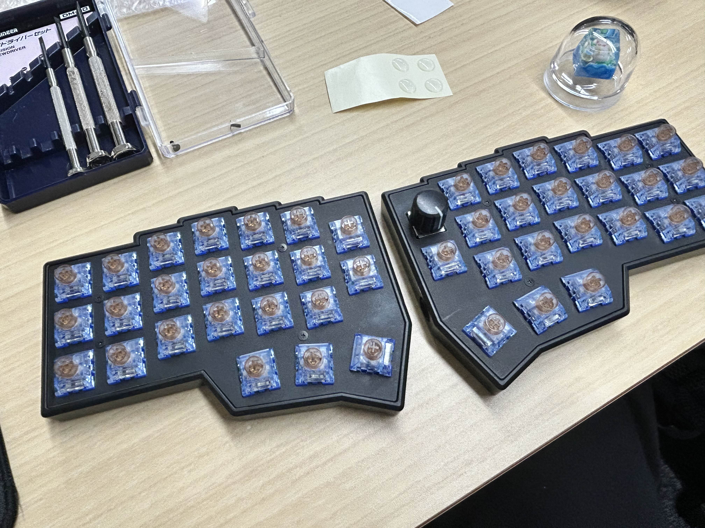

# Corne v4.1 (takow keymap)

Personal Vial firmware & keymap for Corne v4.1 (RP2040, JIS).

| 写真 | |
|---|---|
| Built |  |
| Pre-build |  |

## 現在のキーマップ


SVG は `corne.vil` から GitHub Actions が自動再生成します。手動で再生成したい場合：

```bash
python scripts/vil_to_svg.py corne.vil -o assets/keymap.svg
```

## ハード仕様

| 項目 | 値 |
|---|---|
| ボード | Corne v4.1 (rev4_1/standard, RP2040) |
| USB VID/PID | `0x4653` / `0x0004` |
| 配列 | JIS |
| LED | RGB Matrix |
| 接続 | TRS (3極) split |
| エンコーダー | 右側 1個 |

## ビルド

### ローカル (WSL Ubuntu)

vial-qmk が `~/vial-qmk` にある前提：

```bash
./build.sh          # → build/crkbd_rev4_1_standard_takow.uf2
./build.sh clean    # クリーン
./build.sh flash    # 書込手順表示
```

### GitHub Actions

- `keymap/` 配下を変更して `main` に push すると自動ビルド
- 成果物は Actions の Artifacts に 90 日保持
- タグ push (`v*`) で GitHub Release に UF2 添付

## 書き込み手順

両半とも同じ UF2 でOK（ハンドネスは `GP21` ピンで自動判定）。

1. USB を抜く
2. **左手**: 物理 `Q` キーを押しながら USB 接続 → `RPI-RP2` ドライブ出現 → UF2 をドラッグ
3. **右手**: 物理 `P` キーを押しながら USB 接続 → 同じ UF2 をドラッグ
4. TRS ケーブルで両半接続 → 左手だけ USB で PC に接続

すでにVialファームが入っているなら、Adjustレイヤー（Layer 3）の左上 `QK_BOOT` キーで BOOTSEL モードに入れます。

## ファイル構成

```
corne_v4/
├── .github/workflows/
│   ├── build.yml          # UF2 自動ビルド
│   └── keymap-image.yml   # SVG 自動生成
├── assets/
│   ├── keyboard.jpg
│   ├── pre.jpg
│   └── keymap.svg         # ← 自動生成
├── keymap/                # vial-qmk へ symlink (ローカルビルド用)
│   ├── config.h
│   ├── keymap.c
│   ├── rules.mk
│   └── vial.json
├── scripts/
│   └── vil_to_svg.py      # .vil → SVG レンダラ
├── corne.vil              # 現在のキーマップ (Vial export)
├── build.sh               # ローカルビルドヘルパー
└── README.md
```

## トラブルシュート Tips

- **右半身が反応しない**：`rules.mk` の `RGBLIGHT_ENABLE` / `RGB_MATRIX_ENABLE` が `info.json` (`rgblight: false`, `rgb_matrix: true`) と一致しているか確認。逆だと split 通信が壊れる
- **Vial で `KeyError: (0, 0, 0)`**：`ENCODER_ENABLE = yes` + `ENCODER_MAP_ENABLE = yes` + keymap.c で `encoder_map` を定義しているか確認
- **公式 Vial UF2 で動作確認**: ハード切り分け用 → [foostan/kbd_firmware](https://github.com/foostan/kbd_firmware) から `crkbd_rev4_1_standard_vial.uf2`
