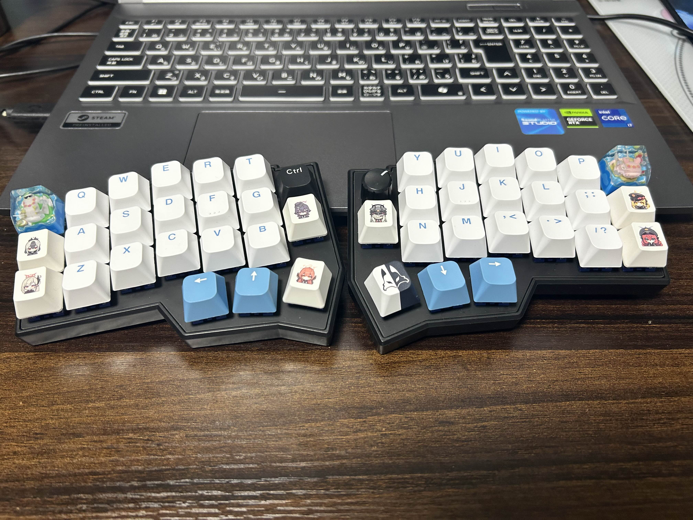
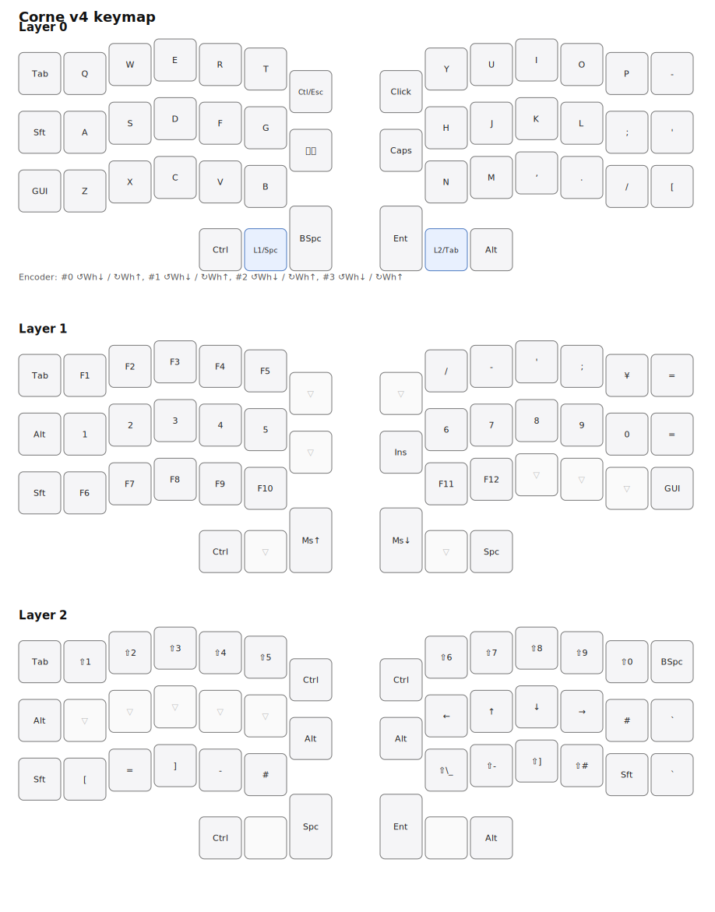

# Corne v4.1 (takow keymap)

Personal Vial firmware & keymap for Corne v4.1 (RP2040, JIS).
Version 1.00

| 写真 | |
|---|---|
| Built |  |
| Keycapなし |  |

## 現在のキーマップ

## ハード仕様

| 項目 | 値 |
|---|---|
| ボード | Corne v4.1 (rev4_1/standard, RP2040) |
| USB VID/PID | `0x4653` / `0x0004` |
| 配列 | JIS |
| LED | RGB Matrix |
| 接続 | TRS (3極) split |
| エンコーダー | 右側 1個 |

## 免責事項

本リポジトリの内容は完全に個人用途のキーボード設定です。利用はすべて自己責任でお願いします。

本リポジトリのファームウェア・キーマップ・スクリプトの利用、または利用できなかったことによって生じた、
キーボード・PC・その他ハードウェアの故障、データの消失、その他いかなる損害についても作者は一切の責任を負いません。
書き込みや設定変更は内容を理解した上で実施してください。
